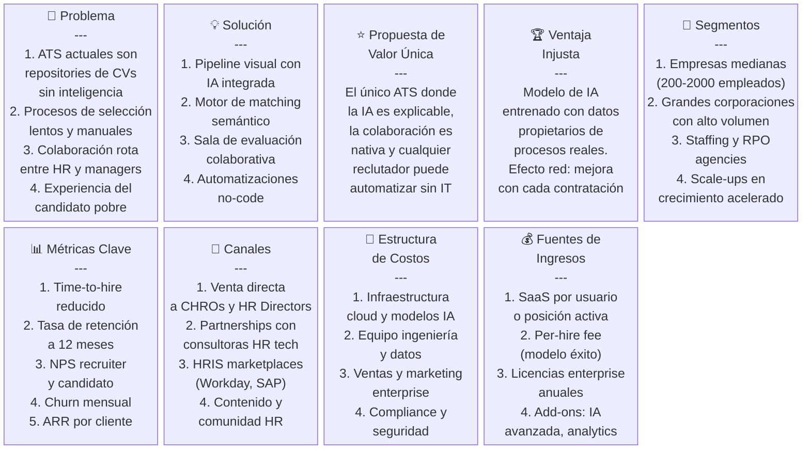
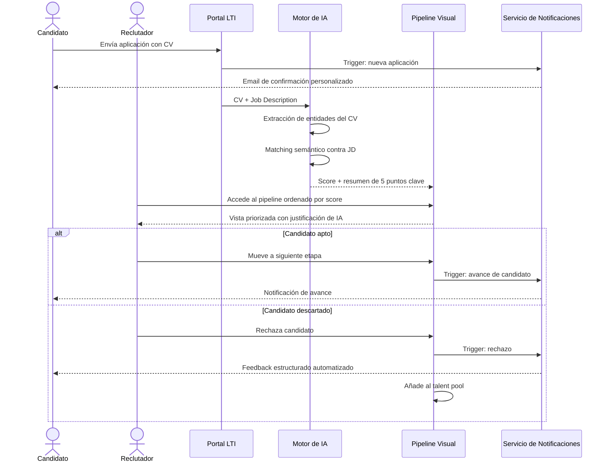
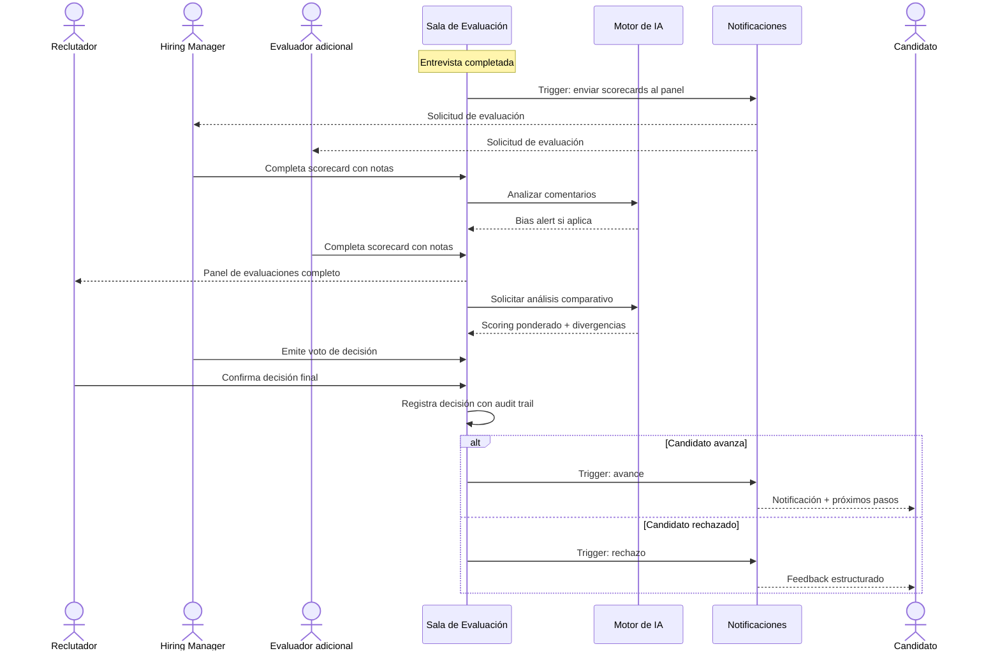
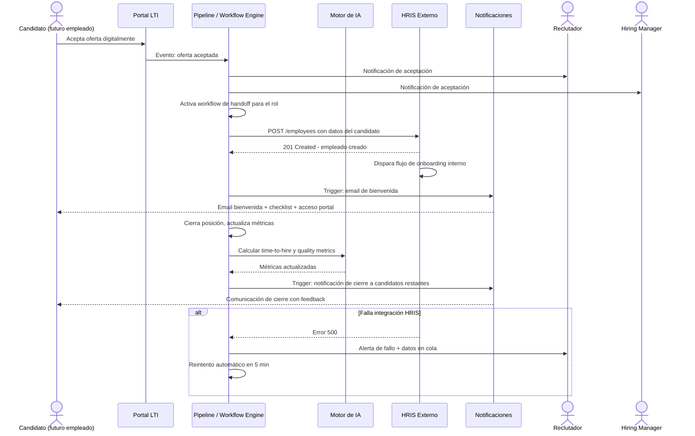
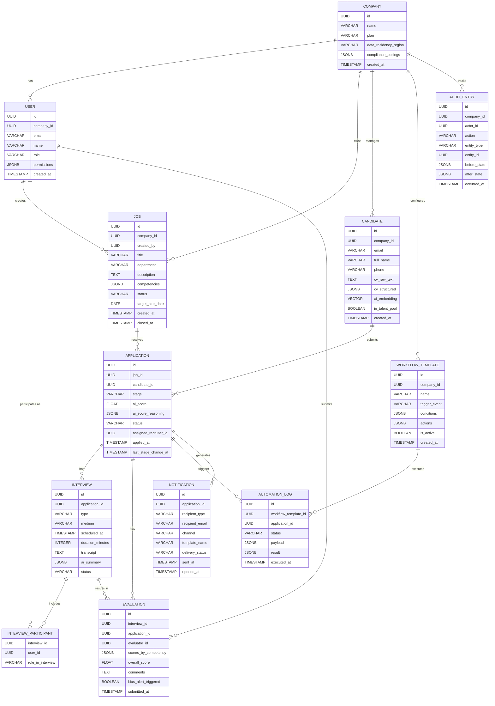
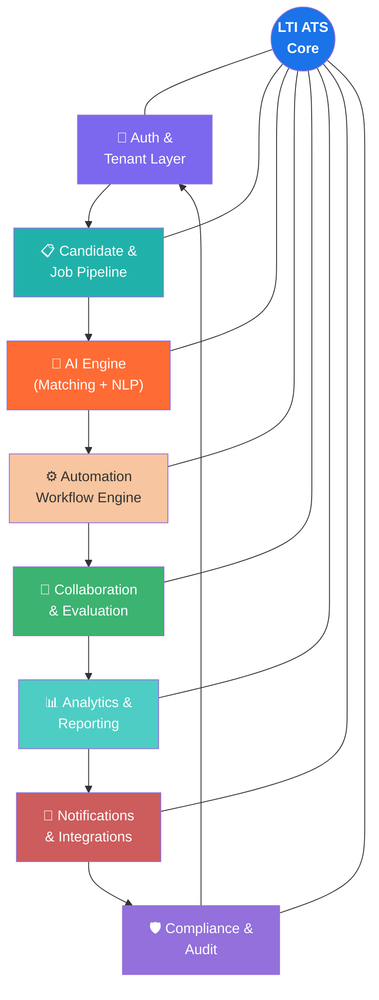
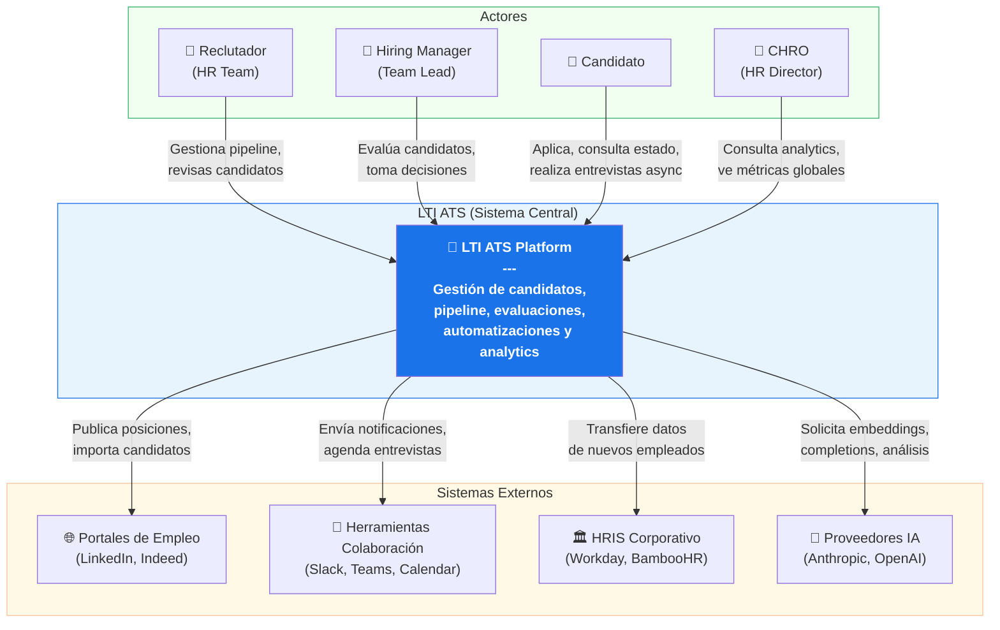
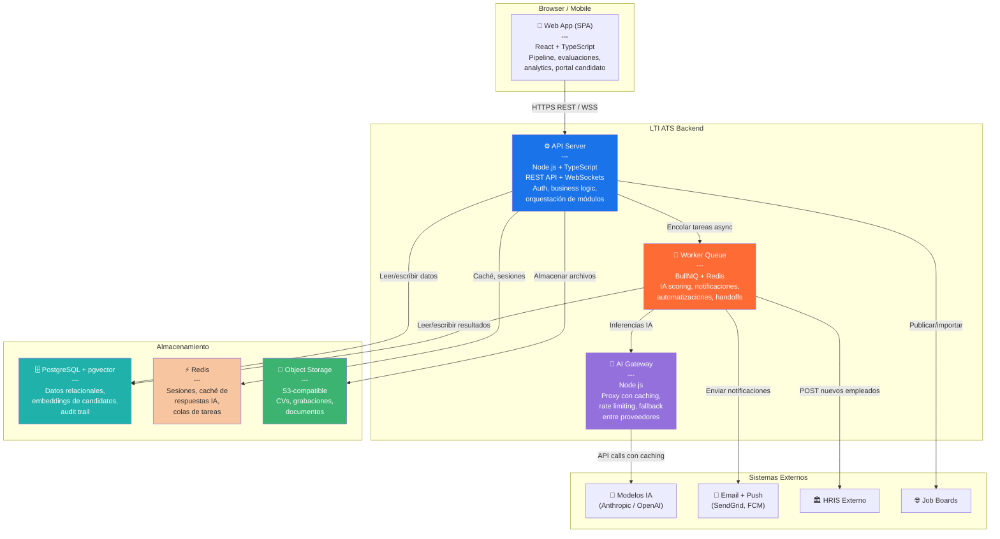
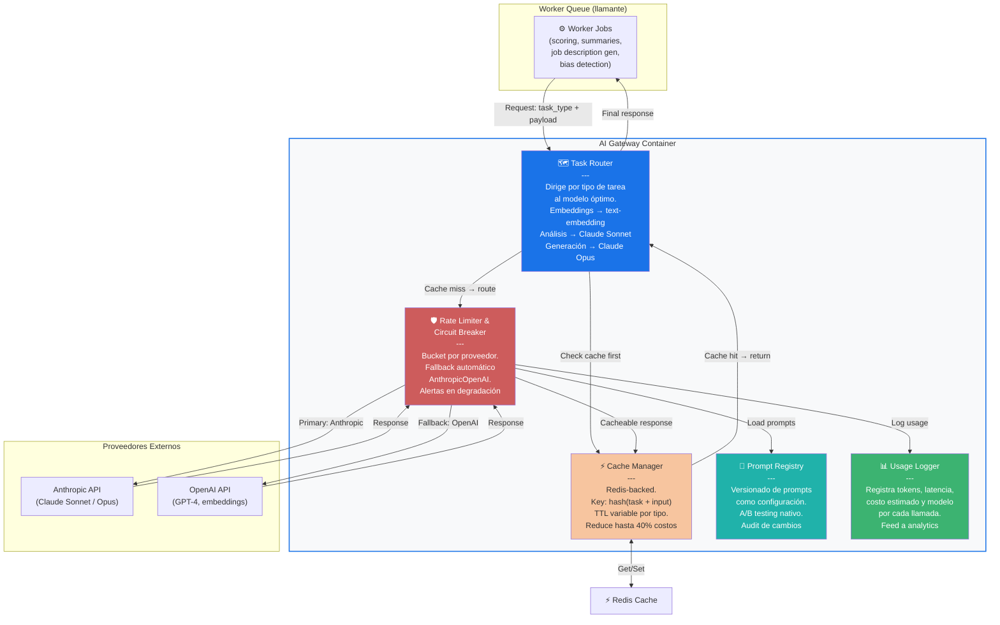

# LTI — ATS del Futuro

## 1. Product overview

LTI es una plataforma SaaS de gestión de candidatos (ATS) de nueva generación diseñada para eliminar la fricción del proceso de selección. Los ATS tradicionales actúan como meros repositorios de CVs: fuerzan a los equipos de HR a realizar manualmente el screening, la coordinación de entrevistas y el seguimiento de candidatos, generando procesos lentos, sesgados y desconectados del negocio. LTI resuelve esto combinando un pipeline visual intuitivo con un motor de inteligencia artificial que automatiza las tareas repetitivas y potencia la toma de decisiones en cada etapa del funnel.

El valor para los departamentos de HR es inmediato: reducción del time-to-hire, eliminación del trabajo administrativo de bajo valor y visibilidad en tiempo real sobre el estado de cada posición. Para los hiring managers, LTI ofrece una interfaz colaborativa que les permite participar en el proceso sin abandonar sus herramientas habituales (Slack, Teams, calendario). Para los candidatos, la plataforma garantiza una experiencia transparente, con comunicaciones personalizadas y feedback estructurado en cada etapa, incluso ante un rechazo.

La ventaja competitiva de LTI frente a incumbentes como Greenhouse, Lever o Workday Recruiting se construye sobre tres pilares: IA explicable (cada recomendación muestra el razonamiento detrás), automatizaciones sin código (cualquier reclutador puede construir workflows complejos sin soporte de IT) y colaboración nativa en tiempo real (no es un añadido, es el núcleo del producto). Mientras los competidores ofrecen IA como feature adicional, en LTI la inteligencia está integrada en cada paso del flujo.

El sistema está diseñado desde el inicio bajo principios API-first y mobile-first, lo que garantiza integración con cualquier stack de HR tech existente y accesibilidad desde cualquier dispositivo. El cumplimiento de GDPR, la anonimización de datos y los audit trails completos hacen de LTI una plataforma apta para mercados regulados, diferenciándola en segmentos enterprise donde la compliance es no negociable.

## 2. Main features

**Pipeline visual con IA integrada** — Board Kanban altamente personalizable donde cada columna representa una etapa del proceso de selección, configurable por rol y departamento. El sistema asigna automáticamente un score de compatibilidad a cada candidato en función del job description usando análisis semántico, lo que permite priorizar sin leer cada CV. La vista de timeline de candidato centraliza el historial completo de interacciones, documentos y evaluaciones en una sola pantalla.

**Motor de matching semántico** — A diferencia de los sistemas basados en keywords, el motor de matching de LTI analiza contexto, progresión de carrera y habilidades transferibles para identificar candidatos adecuados, incluyendo perfiles del pool interno (ex-candidatos, empleados con potencial de movilidad lateral). Esto incrementa la cobertura del funnel sin aumentar el volumen de trabajo del equipo de selección.

**Sala de evaluación colaborativa** — Espacio de trabajo compartido donde reclutadores y hiring managers completan scorecards estructuradas en tiempo real, con soporte para menciones (@usuario), comentarios anclados a criterios específicos y paneles de decisión con votación ponderada. Elimina los intercambios de email con feedback disperso y reduce el tiempo desde entrevista hasta decisión.

**Motor de automatizaciones no-code** — Constructor visual de workflows con lógica condicional (si/entonces/sino) que permite a cualquier reclutador crear automatizaciones sofisticadas sin soporte de IT. Incluye templates predefinidos para distintos tipos de posición (tech, ventas, masivos, ejecutivo) y acciones como agendado automático de entrevistas, envío de comunicaciones personalizadas, reminders y apertura de flujos en sistemas externos (HRIS, onboarding).

**Asistencia de IA en todo el ciclo** — Suite de herramientas de IA integradas en cada etapa: generación de job descriptions con lenguaje inclusivo y optimizados para SEO, resúmenes automáticos de CV con highlight de gaps, sugerencia de preguntas de entrevista por competencia, transcripción y resumen post-entrevista con análisis de sentimiento, detección de sesgos en los comentarios de los evaluadores y predicción de probabilidad de aceptación de oferta.

**Portal de experiencia del candidato** — Portal self-service donde los candidatos consultan el estado de su aplicación en tiempo real, reagendan entrevistas y reciben feedback estructurado (incluso en caso de rechazo). Soporta entrevistas asincrónicas en formato video y texto para roles de alto volumen. Las comunicaciones son hiperpersonalizadas según la etapa y el canal preferido por el candidato.

**Analítica conversacional e inteligencia de negocio** — Dashboards en tiempo real con métricas clave (time-to-fill, time-to-hire, cost-per-hire, quality of hire) segmentadas por departamento, rol y fuente. Cada rol tiene su vista adaptada: reclutador, hiring manager y CHRO. Incluye un chatbot conversacional que permite hacer consultas en lenguaje natural sobre los datos ("¿cuánto tardamos en contratar ingenieros senior el Q1?") y detección proactiva de cuellos de botella en el funnel.

**Compliance y gobernanza de datos** — Configuración de data residency por región, anonimización automática de datos sensibles en etapas de screening (blind hiring mode), audit trail completo de todas las decisiones con timestamp y actor, y retención/destrucción automática de datos según políticas configurables. Compatible con GDPR y normativas de protección de datos de múltiples jurisdicciones.

## 3. Lean Canvas

El modelo de negocio de LTI se basa en una suscripción SaaS escalable dirigida principalmente a empresas de tamaño mediano y grande con procesos de contratación continuos. Los ingresos se generan a través de planes mensuales por número de usuarios activos o posiciones abiertas, complementados por un modelo de tarifa por contratación para clientes que prefieren alinear el costo con el resultado. El canal principal de adquisición es la venta directa a directores de HR y CHROs, apoyada por partnerships con consultoras de HR tech y presencia en marketplaces de sistemas HRIS líderes como Workday, SAP SuccessFactors y BambooHR.

Los costos principales están concentrados en infraestructura cloud (entrenamiento y servicio de modelos de IA, almacenamiento de datos de candidatos) y en el equipo de ingeniería y datos que mantiene y mejora el motor de matching y los modelos de asistencia. La ventaja injusta del negocio se construye con el tiempo: a medida que más organizaciones usan LTI, el modelo de IA se entrena con más datos anonimizados de procesos de selección reales, lo que mejora la precisión del matching y crea un foso competitivo difícil de replicar para nuevos entrantes.

## 4. Use cases

### Use case 1: Screening automatizado y priorización de candidatos con IA

**Actor(s):** Reclutador

**Description:** El reclutador abre una nueva posición y necesita procesar un alto volumen de aplicaciones en el menor tiempo posible. Quiere que el sistema haga un primer filtro inteligente y le presente los candidatos más relevantes con un resumen accionable, sin tener que leer cada CV manualmente.

**Preconditions:**
- La posición está publicada y activa en el sistema.
- Al menos un candidato ha aplicado.
- El job description está cargado con competencias y requisitos definidos.

**Main flow:**
1. El candidato envía su aplicación a través del portal o integración con LinkedIn/Indeed.
2. El sistema confirma recepción al candidato por email personalizado.
3. El motor de IA extrae entidades del CV (experiencia, habilidades, educación, progresión).
4. El motor compara el perfil del candidato contra el JD usando análisis semántico y asigna un score de compatibilidad (0–100) con justificación.
5. El reclutador accede al pipeline y ve los candidatos ordenados por score con un resumen de 3–5 puntos clave por perfil.
6. El reclutador revisa los candidatos top, acepta o rechaza con un clic, o mueve al siguiente estado.
7. Los candidatos descartados reciben notificación automática y son añadidos al talent pool para futuras posiciones.

**Alternative flows:**
- Si el CV está en formato no parseable (imagen), el sistema lo señala y solicita al candidato un formato alternativo.
- Si el score del candidato está en zona gris (40–60), el sistema sugiere una entrevista de screening breve antes de descartar.
- Si el reclutador sobreescribe la recomendación de la IA repetidamente en una posición, el sistema aprende y ajusta el modelo para ese tipo de rol.

**Postconditions:**
- Cada candidato tiene un score asignado y un estado en el pipeline.
- El reclutador ha reducido el tiempo de revisión de CVs en al menos un 60%.
- Los candidatos descartados han recibido comunicación y están en el talent pool.

### Use case 2: Evaluación colaborativa en tiempo real tras entrevista

**Actor(s):** Reclutador, Hiring Manager, Panel de entrevistadores

**Description:** Tras una ronda de entrevistas, múltiples evaluadores necesitan registrar su feedback de forma estructurada, comparar criterios y tomar una decisión colectiva de forma ágil, sin loops de email ni reuniones extra de calibración.

**Preconditions:**
- El candidato ha completado al menos una entrevista.
- Los evaluadores tienen scorecards asignadas según su rol en el proceso.
- La posición tiene criterios de evaluación definidos (competencias + peso).

**Main flow:**
1. Tras la entrevista, cada evaluador recibe notificación para completar su scorecard.
2. Cada evaluador accede a la sala de evaluación y completa la scorecard con notas y puntuación por competencia.
3. El sistema muestra en tiempo real el progreso de completitud del panel (quién ha evaluado, quién falta).
4. Una vez todos los evaluadores han completado sus scorecards, el sistema genera un panel comparativo automático con scoring ponderado.
5. La IA destaca coincidencias y divergencias significativas entre evaluadores y señala posibles sesgos en los comentarios.
6. El hiring manager convoca una votación estructurada: avanzar / solicitar otra entrevista / rechazar.
7. El sistema registra la decisión con timestamp, justificación y todos los participantes.

**Alternative flows:**
- Si un evaluador no completa la scorecard en 24 horas, recibe un reminder automático escalable (al reclutador si no responde en 48h).
- Si el panel está dividido (votos igualados), el sistema notifica al reclutador para organizar una sesión de calibración.
- Si la IA detecta comentarios con lenguaje sesgado (género, edad, origen), muestra un bias alert al evaluador antes de guardar.

**Postconditions:**
- Todos los evaluadores tienen sus scorecards registradas y trazables.
- La decisión queda documentada con razonamiento y audit trail completo.
- El candidato avanza o es notificado con feedback estructurado.

### Use case 3: Handoff automático a onboarding tras aceptación de oferta

**Actor(s):** Reclutador, sistema HRIS externo, candidato (nuevo empleado)

**Description:** Cuando un candidato acepta una oferta de trabajo, el reclutador necesita que el proceso de onboarding se active de forma automática y coordinada entre múltiples sistemas, sin duplicar la carga de datos manualmente en cada plataforma.

**Preconditions:**
- El candidato tiene estado "Oferta enviada" en el pipeline.
- El sistema HRIS está integrado vía API.
- El workflow de onboarding está configurado para el tipo de posición.

**Main flow:**
1. El candidato recibe la oferta a través del portal y la acepta digitalmente.
2. El sistema actualiza el estado del candidato a "Contratado" y notifica al reclutador y al hiring manager.
3. El workflow de handoff se activa automáticamente según el template configurado para el rol.
4. LTI envía al HRIS los datos del nuevo empleado (nombre, rol, departamento, fecha de inicio, salario acordado) via API.
5. El HRIS crea el registro del empleado y dispara su propio flujo de onboarding.
6. LTI envía al nuevo empleado un email de bienvenida con los próximos pasos, checklist de documentación y acceso al portal de onboarding.
7. La posición se marca como cerrada y los métricas de time-to-hire se actualizan automáticamente en el dashboard.
8. Los candidatos restantes en el pipeline son notificados del cierre de la posición con feedback personalizado.

**Alternative flows:**
- Si la integración con el HRIS falla, el reclutador recibe una alerta inmediata y los datos quedan en cola para reintento automático.
- Si el candidato rechaza la oferta, el sistema activa un workflow de contraoferta configurable y alerta al reclutador con recomendaciones basadas en predicción de rangos de aceptación.
- Si la fecha de inicio supera los 30 días, el sistema programa un nurture de pre-boarding automatizado para mantener el engagement del nuevo empleado.

**Postconditions:**
- El nuevo empleado tiene registro activo en el HRIS con todos sus datos.
- La posición está cerrada y las métricas actualizadas.
- Todos los candidatos del pipeline han recibido comunicación de cierre.
- El audit trail registra todos los pasos del handoff con timestamps.

## 5. Data model

**Company** — Organización que usa la plataforma. Contiene la configuración del tenant, plan de suscripción y ajustes de compliance por región.

**User** — Cualquier persona con acceso al sistema (reclutador, hiring manager, CHRO, entrevistador). Tiene rol y permisos asociados al nivel de acceso en el pipeline.

**Job** — Posición abierta con su descripción, requisitos, competencias evaluadas y configuración del proceso de selección (stages, scorecards, workflows).

**Candidate** — Persona que ha aplicado o ha sido importada al sistema. Almacena datos de contacto, CV estructurado y pertenencia al talent pool.

**Application** — Relación entre un candidato y una posición específica. Rastrea el estado actual en el pipeline, el score de IA y el historial de movimientos.

**Interview** — Instancia de una entrevista agendada, con participantes, tipo (técnica, cultural, asincrónica), medio (videollamada, presencial) y transcripción generada por IA.

**Evaluation** — Scorecard completada por un evaluador para una aplicación específica. Contiene puntuaciones por competencia, comentarios y flag de bias alert si aplica.

**WorkflowTemplate** — Definición reutilizable de un proceso de selección automatizado, con sus triggers, condiciones y acciones configuradas en el builder no-code.

**AutomationLog** — Registro de cada ejecución de una automatización, con estado, payload enviado y resultado, para debugging y auditoría.

**Notification** — Comunicación enviada a candidatos o usuarios del sistema, con el canal utilizado, plantilla, estado de entrega y apertura.

**AuditEntry** — Registro inmutable de cualquier acción relevante en el sistema: cambios de estado, decisiones, accesos, modificaciones de datos personales.

## 6. High-level system design

LTI adopta una arquitectura de **monolito modular** para la primera versión, organizada en dominios de negocio bien definidos (Candidates, Jobs, Interviews, Automations, Analytics, Notifications, AI Services) con interfaces internas claras entre módulos. Esta decisión prioriza la velocidad de desarrollo y la coherencia transaccional sobre la escalabilidad horizontal prematura, sin cerrar la puerta a extraer microservicios en el futuro cuando el volumen lo justifique. La comunicación entre módulos críticos se realiza de forma síncrona a través de interfaces internas, mientras que los procesos de larga duración (ejecución de automatizaciones, envío de notificaciones, inferencias de IA) se delegan a una cola de tareas asíncronas mediante un worker queue (e.g., BullMQ sobre Redis).

Los componentes principales son: una **API REST + WebSocket** que sirve tanto la aplicación web como las integraciones externas, un **motor de IA** que encapsula los servicios de embedding, matching semántico, análisis de texto y generación de contenido (orquestados sobre modelos como Claude o GPT-4 vía APIs, con caching agresivo para reducir costos), un **motor de automatizaciones** que evalúa triggers y ejecuta las acciones definidas en los workflow templates, y un **servicio de notificaciones** multi-canal (email, Slack, webhooks) desacoplado del flujo principal mediante eventos.

Las integraciones externas clave son: portales de empleo (LinkedIn, Indeed) vía APIs de job posting e importación de candidatos, herramientas de comunicación y calendario (Slack, Teams, Google Calendar, Outlook) para notificaciones y agendado, sistemas HRIS (Workday, BambooHR, SAP SuccessFactors) para el handoff de nuevos empleados, y proveedores de IA (Anthropic, OpenAI) para los modelos de lenguaje. Todas las integraciones se abstraen detrás de adapters intercambiables para facilitar el mantenimiento.

El flujo de datos principal sigue este camino: una aplicación entra por el portal o API → el módulo de candidatos la procesa y dispara una tarea de IA para scoring → el pipeline actualiza el estado y notifica a los reclutadores → las interacciones de usuarios (scorecards, decisiones, movimientos de pipeline) generan eventos que pueden disparar automatizaciones → todas las acciones relevantes se registran en el audit log → el módulo de analytics agrega los eventos para actualizar dashboards en tiempo real.

## 7. C4 diagram

### Level 1 — System context

El diagrama de contexto muestra a LTI ATS como el sistema central relacionándose con cuatro tipos de actores humanos (Reclutador, Hiring Manager, Candidato y CHRO) y con los sistemas externos con los que intercambia datos. Los sistemas externos incluyen portales de empleo para publicación y captación, herramientas de colaboración para notificaciones en tiempo real, el HRIS corporativo para el handoff de empleados, y los proveedores de modelos de IA que potencian el motor de matching y análisis de texto.

### Level 2 — Container diagram

Dentro de LTI ATS, el sistema se compone de cinco contenedores principales que se comunican entre sí. La Single Page Application (SPA) en React sirve la interfaz para reclutadores, managers y candidatos. La API REST + WebSocket (Node.js/TypeScript) expone los endpoints y gestiona las conexiones en tiempo real para la sala de evaluación colaborativa. La base de datos principal (PostgreSQL con extensión pgvector para embeddings) almacena todos los datos relacionales y vectoriales. El worker queue (BullMQ sobre Redis) gestiona el procesamiento asíncrono de tareas pesadas. Y el AI Gateway actúa como proxy hacia los modelos externos, gestionando caching, rate limiting y fallbacks entre proveedores.

### Level 3 — Component diagram (AI Gateway)

El AI Gateway es el componente más crítico desde el punto de vista arquitectónico porque media todas las interacciones con los modelos externos de lenguaje e impacta directamente en los costos, la latencia y la disponibilidad de las funcionalidades de IA. Internamente se compone de cuatro elementos: un Router que dirige cada tipo de tarea al modelo más adecuado (e.g., embeddings a un modelo más barato, análisis complejo a Claude Opus), un Cache Manager que evita llamadas duplicadas para perfiles o JDs ya procesados (con TTL configurable por tipo de tarea), un Rate Limiter & Circuit Breaker que protege contra sobrecargas y gestiona el fallback entre proveedores, y un Prompt Registry que centraliza todos los prompts del sistema como configuración versionada, separándolos del código de aplicación.

